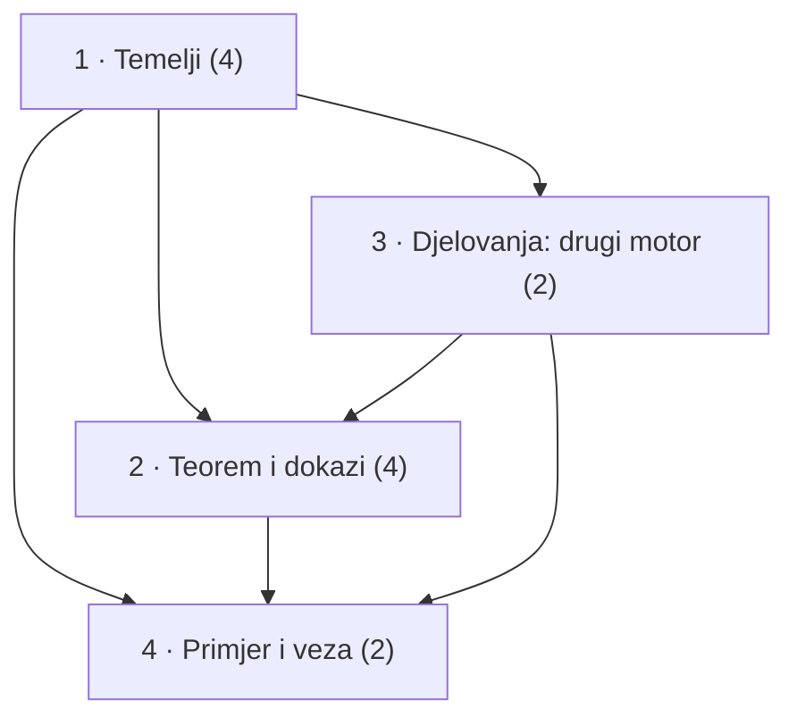
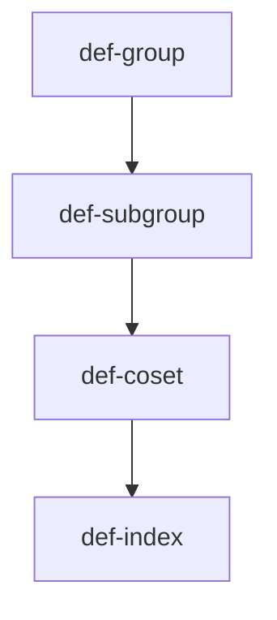
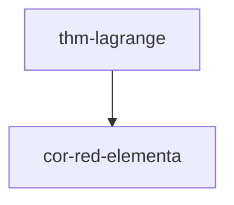
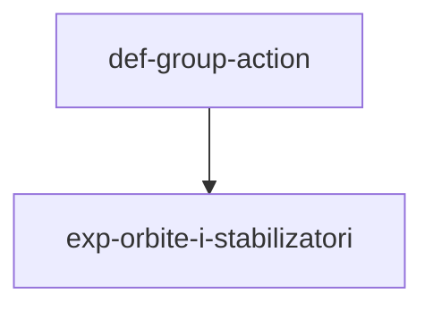
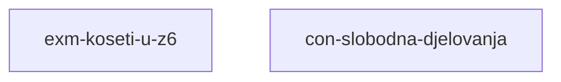

# Graf ovisnosti

> [!TIP] Ovo je statični Obsidian-prikaz. **Interaktivni prikaz** — sklopive cjeline, označavanje napretka (savladano / spremno / nije spremno), pretraga — je `views/forest.html`: otvori ga **u pregledniku** (dvoklik u file manageru), ne u Obsidianu.

Bridovi su `depends` veze: strelica vodi od preduvjeta prema stablu
koje ga treba. Graf je tranzitivno reduciran — brid koji slijedi iz
duljeg puta je izostavljen. Dokazi (`prf-`) i zadatci (`exr-`) su
izostavljeni radi čitljivosti; potpuni interaktivni prikaz je
`views/forest.html`.

*(Generirano 2026-09-07 alatom forest-digest.)*

## Pregled po cjelinama

## 1 · Temelji

- [[def-group]] — Grupa
- [[def-subgroup]] — Podgrupa
- [[def-coset]] — Koset
- [[def-index]] — Indeks podgrupe

## 2 · Teorem i dokazi

- [[thm-lagrange]] — Lagrangeov teorem
- [[cor-red-elementa]] — Red elementa dijeli red grupe

## 3 · Djelovanja: drugi motor

- [[def-group-action]] — Djelovanje grupe
- [[exp-orbite-i-stabilizatori]] — Orbite: kako djelovanje particionira skup

## 4 · Primjer i veza

- [[exm-koseti-u-z6]] — Koseti podgrupe {0, 3} u Z₆
- [[con-slobodna-djelovanja]] — Lagrange kao specijalan slučaj slobodnih djelovanja
