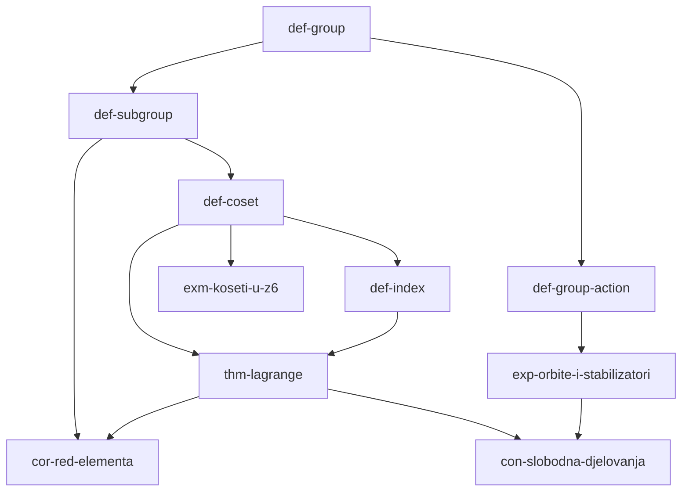

# Graf ovisnosti

Bridovi su `depends` veze među stablima: strelica od preduvjeta prema
stablu koje ga treba. Dokazi (`prf-`) su izostavljeni radi čitljivosti —
svaki visi o svom teoremu; vidi [[thm-lagrange]] za oba.

Dva ulaza bez preduvjeta: [[def-group]] je korijen svega, a graf se
odmah grana u dva motora — kosete (lijeva grana) i djelovanja (desna) —
koji se ponovno sastaju u [[con-slobodna-djelovanja]].
