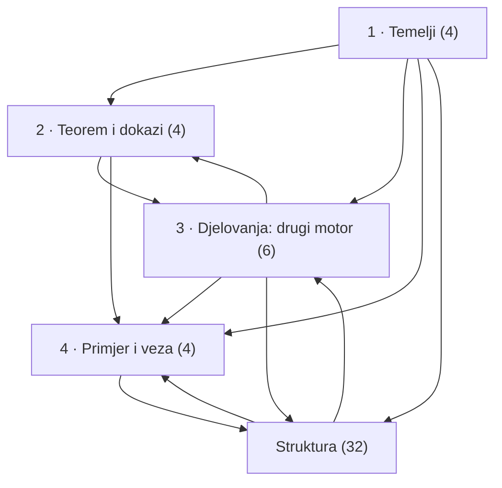
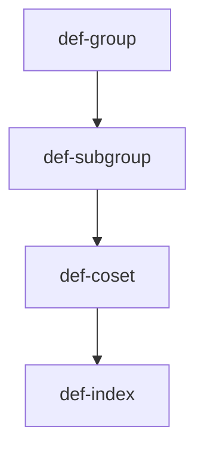
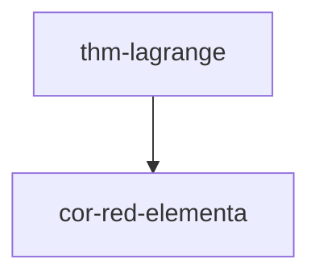
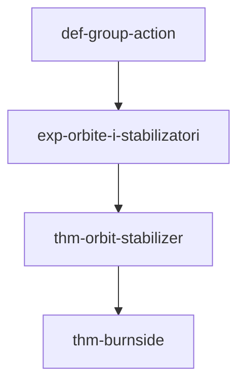
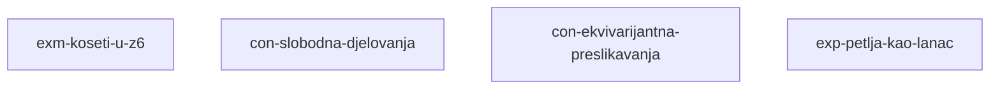
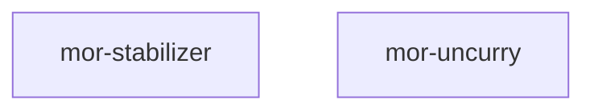

# Graf ovisnosti

> [!TIP] Ovo je statični Obsidian-prikaz. **Interaktivni prikaz** — sklopive cjeline, označavanje napretka (savladano / spremno / nije spremno), pretraga — je `views/forest.html`: otvori ga **u pregledniku** (dvoklik u file manageru), ne u Obsidianu.

Bridovi su `depends` veze: strelica vodi od preduvjeta prema stablu
koje ga treba. Graf je tranzitivno reduciran — brid koji slijedi iz
duljeg puta je izostavljen. Dokazi (`prf-`) i zadatci (`exr-`) su
izostavljeni radi čitljivosti; potpuni interaktivni prikaz je
`views/forest.html`.

*(Generirano 2026-09-07 alatom forest-digest.)*

## Pregled po cjelinama

```mermaid
graph TD
    g0["1 · Temelji (4)"]
    g1["2 · Teorem i dokazi (4)"]
    g2["3 · Djelovanja: drugi motor (6)"]
    g3["4 · Primjer i veza (4)"]
    g4["Struktura (32)"]
    g0 --> g1
    g0 --> g2
    g0 --> g3
    g0 --> g4
    g1 --> g2
    g1 --> g3
    g2 --> g1
    g2 --> g3
    g2 --> g4
    g3 --> g4
    g4 --> g2
    g4 --> g3
```

## 1 · Temelji

```mermaid
graph TD
    def_group["def-group"]
    def_subgroup["def-subgroup"]
    def_coset["def-coset"]
    def_index["def-index"]
    def_subgroup --> def_coset
    def_coset --> def_index
    def_group --> def_subgroup
```

- [[def-group]] — Grupa
- [[def-subgroup]] — Podgrupa
- [[def-coset]] — Koset
- [[def-index]] — Indeks podgrupe

## 2 · Teorem i dokazi

```mermaid
graph TD
    thm_lagrange["thm-lagrange"]
    cor_red_elementa["cor-red-elementa"]
    thm_lagrange --> cor_red_elementa
```

- [[thm-lagrange]] — Lagrangeov teorem
- [[cor-red-elementa]] — Red elementa dijeli red grupe

## 3 · Djelovanja: drugi motor

```mermaid
graph TD
    def_group_action["def-group-action"]
    exp_orbite_i_stabilizatori["exp-orbite-i-stabilizatori"]
    thm_orbit_stabilizer["thm-orbit-stabilizer"]
    thm_burnside["thm-burnside"]
    def_group_action --> exp_orbite_i_stabilizatori
    thm_orbit_stabilizer --> thm_burnside
    exp_orbite_i_stabilizatori --> thm_orbit_stabilizer
```

- [[def-group-action]] — Djelovanje grupe
- [[exp-orbite-i-stabilizatori]] — Orbite: kako djelovanje particionira skup
- [[thm-orbit-stabilizer]] — Teorem o orbiti i stabilizatoru
- [[thm-burnside]] — Burnsideova lema

## 4 · Primjer i veza

```mermaid
graph TD
    exm_koseti_u_z6["exm-koseti-u-z6"]
    con_slobodna_djelovanja["con-slobodna-djelovanja"]
    con_ekvivarijantna_preslikavanja["con-ekvivarijantna-preslikavanja"]
    exp_petlja_kao_lanac["exp-petlja-kao-lanac"]
```

- [[exm-koseti-u-z6]] — Koseti podgrupe {0, 3} u Z₆
- [[con-slobodna-djelovanja]] — Lagrange kao specijalan slučaj slobodnih djelovanja
- [[con-ekvivarijantna-preslikavanja]] — Ekvivarijantna preslikavanja: morfizmi među djelovanjima
- [[exp-petlja-kao-lanac]] — Petlja kao lanac

## Struktura

```mermaid
graph TD
    obj_set["obj-set"]
    obj_nat["obj-nat"]
    obj_group["obj-group"]
    obj_subgroup["obj-subgroup"]
    obj_group_action["obj-group-action"]
    obj_perm_rep["obj-perm-rep"]
    obj_monoid_action["obj-monoid-action"]
    obj_g_sets["obj-g-sets"]
    obj_acted_set["obj-acted-set"]
    obj_acting_group["obj-acting-group"]
    obj_ambient_group["obj-ambient-group"]
    obj_group_action_source["obj-group-action-source"]
    obj_group_action_target["obj-group-action-target"]
    obj_ogrlice_z6["obj-ogrlice-z6"]
    obj_podgrupa_z6["obj-podgrupa-z6"]
    obj_set --> obj_acted_set
    obj_group --> obj_acting_group
    obj_group --> obj_ambient_group
    obj_group_action --> obj_group_action_source
    obj_group_action --> obj_group_action_target
    obj_group_action --> obj_monoid_action
    obj_group_action --> obj_ogrlice_z6
    obj_group --> obj_perm_rep
    obj_set --> obj_perm_rep
    obj_subgroup --> obj_podgrupa_z6
```

```mermaid
graph TD
    obj_subgroup_as_group["obj-subgroup-as-group"]
    mor_act_by_element["mor-act-by-element"]
    mor_action_group["mor-action-group"]
    mor_action_set["mor-action-set"]
    mor_cayley["mor-cayley"]
    mor_coset_action["mor-coset-action"]
    mor_curry["mor-curry"]
    mor_equivariant_map["mor-equivariant-map"]
    mor_fixed_points["mor-fixed-points"]
    mor_g_sets["mor-g-sets"]
    mor_inclusion["mor-inclusion"]
    mor_monoid_action["mor-monoid-action"]
    mor_orbit_count["mor-orbit-count"]
    mor_orbits["mor-orbits"]
    mor_rho["mor-rho"]
    obj_subgroup_as_group --> mor_inclusion
    mor_orbits --> mor_orbit_count
```

```mermaid
graph TD
    mor_stabilizer["mor-stabilizer"]
    mor_uncurry["mor-uncurry"]
```

- [[obj-set]] — Skup
- [[obj-nat]] — Prirodni broj
- [[obj-group]] — Grupa
- [[obj-subgroup]] — Podgrupa
- [[obj-group-action]] — Djelovanje grupe na skupu
- [[obj-perm-rep]] — Permutacijska reprezentacija
- [[obj-monoid-action]] — Djelovanje monoida na skupu
- [[obj-g-sets]] — Kategorija G-skupova
- [[obj-acted-set]] — Skup na kojem se djeluje
- [[obj-acting-group]] — Grupa koja djeluje
- [[obj-ambient-group]] — Okolna grupa
- [[obj-group-action-source]] — Djelovanje na skupu X
- [[obj-group-action-target]] — Drugo djelovanje iste grupe
- [[obj-ogrlice-z6]] — Rotacije ogrlice od šest perli
- [[obj-podgrupa-z6]] — Podgrupa $\{0,3\}$ u $\mathbb{Z}_6$
- [[obj-subgroup-as-group]] — Podgrupa kao grupa za sebe
- [[mor-act-by-element]] — Djelovanje jednog elementa
- [[mor-action-group]] — Grupa koja djeluje
- [[mor-action-set]] — Skup na kojem se djeluje
- [[mor-cayley]] — Grupa djeluje na sebi: Cayleyjevo djelovanje
- [[mor-coset-action]] — Djelovanje na kosetima
- [[mor-curry]] — Djelovanje kao homomorfizam u Sym(X)
- [[mor-equivariant-map]] — Ekvivarijantno preslikavanje
- [[mor-fixed-points]] — Fiksne točke
- [[mor-g-sets]] — Djelovanje kao objekt kategorije G-skupova
- [[mor-inclusion]] — Inkluzija podgrupe
- [[mor-monoid-action]] — Djelovanje grupe kao djelovanje monoida
- [[mor-orbit-count]] — Broj orbita
- [[mor-orbits]] — Skup orbita
- [[mor-rho]] — Pravilo djelovanja
- [[mor-stabilizer]] — Stabilizator točke
- [[mor-uncurry]] — Homomorfizam u Sym(X) kao djelovanje
